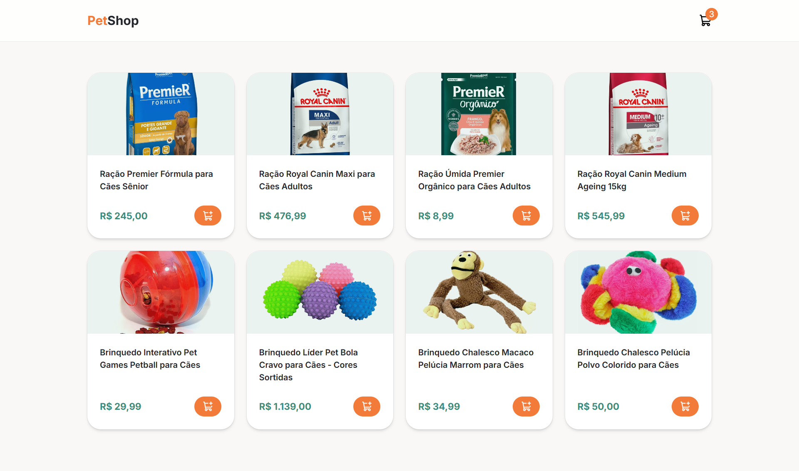
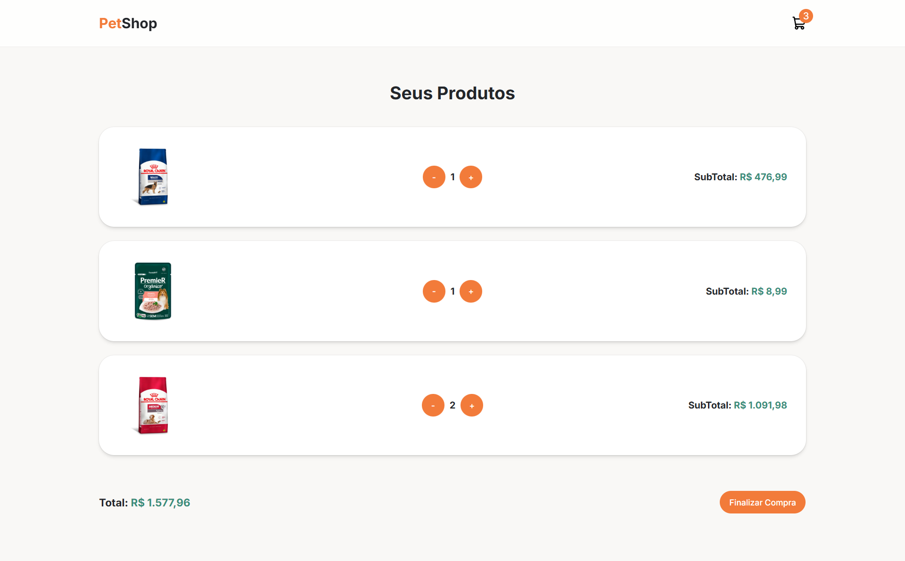

<h1 align="center">🐾 PetShop</h1>

<p align="center">
  <a href="#-português">🇧🇷 Português</a> •
  <a href="#-english">🇺🇸 English</a>
</p>

<p align="center">
  
</p>

---

## 🇧🇷 Português

### 📖 Sobre o projeto

O **PetShop** é um projeto de estudo desenvolvido como desafio do **Módulo 23** do curso **Full Stack Pro**. Trata-se de uma loja virtual de produtos para pets (rações e brinquedos), com listagem de produtos e carrinho de compras.

### ✨ Funcionalidades

- 🛍️ Listagem de produtos consumidos de uma API fake (`json-server`)
- 🛒 Adicionar e remover produtos do carrinho
- 🔢 Controle de quantidade por produto com cálculo de subtotal e total
- 💾 Persistência do carrinho no `localStorage`
- 🔔 Notificações (toasts) ao adicionar/remover produtos e finalizar a compra
- 📱 Layout responsivo

### 🖼️ Telas

| Home | Carrinho |
| :---: | :---: |
|  |  |

### 🚀 Tecnologias

- [React 19](https://react.dev/)
- [TypeScript](https://www.typescriptlang.org/)
- [Vite](https://vite.dev/)
- [Tailwind CSS v4](https://tailwindcss.com/)
- [shadcn/ui](https://ui.shadcn.com/)
- [React Router](https://reactrouter.com/)
- [Axios](https://axios-http.com/)
- [Sonner](https://sonner.emilkowal.ski/) (toasts)
- [Lucide React](https://lucide.dev/) (ícones)
- [JSON Server](https://github.com/typicode/json-server) (API fake)
- Context API (estado global do carrinho)

### ⚙️ Como executar

```bash
# Clone o repositório
git clone https://github.com/Pedrohmdn/petshop-cart.git

# Acesse a pasta do projeto
cd petshop-cart

# Instale as dependências
npm install

# Inicie a API fake (porta 3000)
npx json-server db.json --port 3000

# Em outro terminal, inicie a aplicação
npm run dev
```

Acesse `http://localhost:5173` no navegador.

### 📂 Estrutura

```
src/
├── components/   # Header, Layout, ProductCard, CartItem e componentes de UI
├── contexts/     # CartContext (estado do carrinho)
├── pages/        # Home e Cart
├── services/     # Configuração do Axios
├── utils/        # Formatadores (preço)
└── routes.tsx    # Rotas da aplicação
```

---

## 🇺🇸 English

### 📖 About

**PetShop** is a study project built as the **Module 23** challenge of the **Full Stack Pro** course. It is an online store for pet products (food and toys), featuring a product list and a shopping cart.

### ✨ Features

- 🛍️ Product listing fetched from a fake API (`json-server`)
- 🛒 Add and remove products from the cart
- 🔢 Per-product quantity control with subtotal and total calculation
- 💾 Cart persistence with `localStorage`
- 🔔 Toast notifications when adding/removing products and checking out
- 📱 Responsive layout

### 🖼️ Screenshots

| Home | Cart |
| :---: | :---: |
|  |  |

### 🚀 Tech Stack

- [React 19](https://react.dev/)
- [TypeScript](https://www.typescriptlang.org/)
- [Vite](https://vite.dev/)
- [Tailwind CSS v4](https://tailwindcss.com/)
- [shadcn/ui](https://ui.shadcn.com/)
- [React Router](https://reactrouter.com/)
- [Axios](https://axios-http.com/)
- [Sonner](https://sonner.emilkowal.ski/) (toasts)
- [Lucide React](https://lucide.dev/) (icons)
- [JSON Server](https://github.com/typicode/json-server) (fake API)
- Context API (global cart state)

### ⚙️ Getting Started

```bash
# Clone the repository
git clone https://github.com/Pedrohmdn/petshop-cart.git

# Go to the project folder
cd petshop-cart

# Install dependencies
npm install

# Start the fake API (port 3000)
npx json-server db.json --port 3000

# In another terminal, start the app
npm run dev
```

Open `http://localhost:5173` in your browser.

### 📂 Project Structure

```
src/
├── components/   # Header, Layout, ProductCard, CartItem and UI components
├── contexts/     # CartContext (cart state)
├── pages/        # Home and Cart
├── services/     # Axios setup
├── utils/        # Formatters (price)
└── routes.tsx    # App routes
```

---

